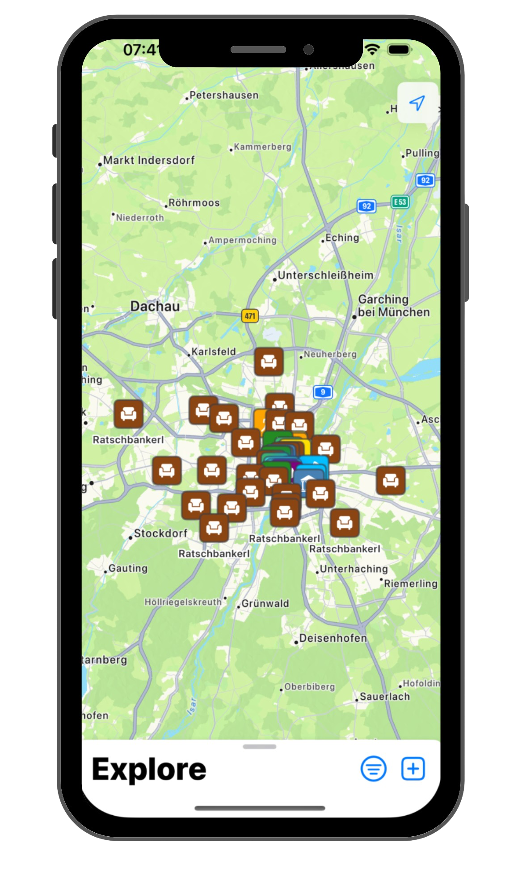
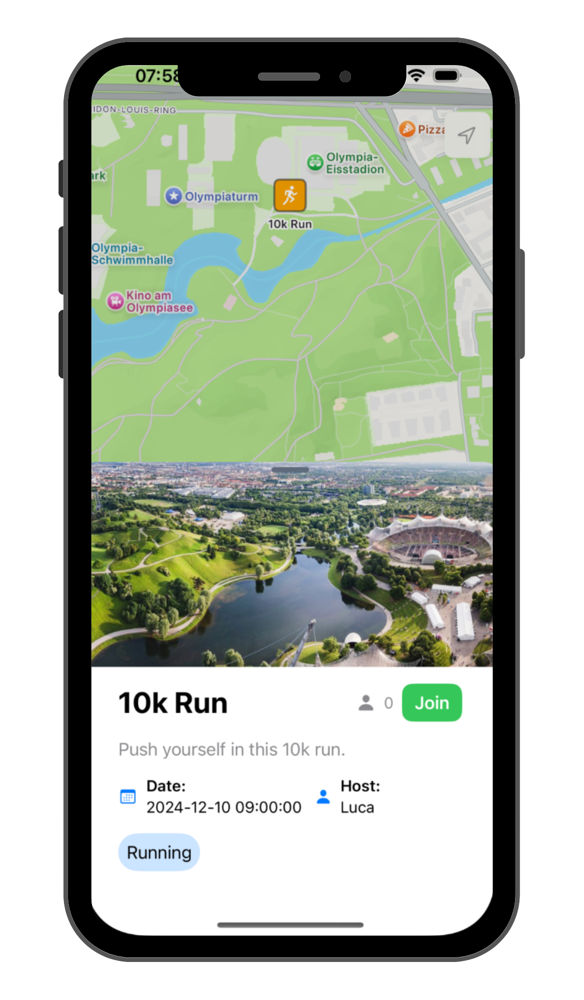

# Minga Connect 💛🥨 - HackaTUM 2024 Project

On November 22-24, 2024, our team participated in the HackaTUM Hackathon in Munich. 
Inspired by the City of Munich's challenge to address loneliness and foster community connections,
we proudly presented our project Minga Connect.

<div style="text-align: center; margin: 20px 0;">
    
</div>

---

## Project Challenge

### Problem

Munich is a vibrant city with 1.6 million residents. However, data shows:

- 30.5% of households are single-person, with limited interaction.
- One in four Germans feels lonely, which has severe health implications.
- There's a pressing need for solutions to foster social interactions across all demographics.
- Our challenge was to design a smart, new, innovative, and valuable solution that addresses loneliness, fosters connection, and works as a responsive MVP for real-world implementation.

### Vision

**Minga Connect** aims to:
- **Strengthen Communities**: Bring people together by creating opportunities for shared experiences.
- **Combat Loneliness**: Help people connect in meaningful ways across different demographics.
- **Promote Inclusion**: Ensure everyone feels welcome, regardless of background or interests.
- **Enhance Local Engagement**: Encourage participation in Munich’s vibrant cultural and social life.
- **Supports inclusivity**: Support across different age groups, cultures, and living situations.

---

## Project implementation

### How Minga Connect Works

1. **Discover Events**: Explore a curated list of activities tailored to your interests.
2. **Join Activities**: RSVP to events with a single click and connect with other participants.
3. **Host Events**: Create your own events, from small meetups to large gatherings, and manage them with ease.
4. **Find Like-Minded People**: Build your social network by connecting with others who share your passions.

<div style="display: flex; justify-content: left; gap: 20px; margin: 20px 0;">
    
    
</div>

### Technologies

Minga Connect is built using state-of-the-art tools to ensure scalability, performance, and user satisfaction:

- **RESTful API**: Reliable, efficient endpoints for managing events and users.
- **Python**: Powers the backend with robust data handling and logic.
- **SwiftUI**: Provides an elegant, user-friendly interface for iOS users.
- **Secure & Scalable Architecture**: Protects user data while scaling to meet community demand.
- **Data-Driven Matching**: Offers intelligent recommendations using user preferences and event data.

### Features

- **Find Activities You Love**: Browse and join events based on categories like:
  - *Bouldering*, *Pub Crawls*, *Chess*, *Hiking*, *Board Games*, *Running*, *Museums*, *Picnics*, *Boccia*, and more!
- **Host Your Own Events**: Share your interests by creating activities for the community to join.
- **Personalized Suggestions**: Minga Connect uses your profile and hobbies to recommend the best activities for you.
- **Simple Interaction**: An intuitive design ensures creating, updating, or joining events is fast and user-friendly.
- **Real-Time Updates**: Stay in sync with any changes to event details or attendee lists.

---

### Getting Started

1. Clone the repository:
   ```bash
   git clone https://github.com/lucabzt/MingaConnect.git
   cd MingaConnect
2. Install backend dependencies:
    ```bash
   pip install -r requirements.txt
3. Follow frontend setup instructions (SwiftUI) to run the iOS app. 
4. Run the server locally and start exploring the Minga Connect platform!

---

### Contributors

Created with 💛 by our HackaTUM 2024 Team in collaboration with the City of Munich. A huge thanks to the organizers and fellow participants for an unforgettable experience.

---

### Future Directions

- Cross-Platform Support: Expand to Android and web platforms.
- Gamification: Add features like badges or rewards to enhance user engagement.
- Localization: Support multiple languages to make the platform accessible for all.
- Event Analytics: Enable hosts to gather feedback and insights on their activities.

Join us in building a more connected and inclusive Munich with Minga Connect! 💛